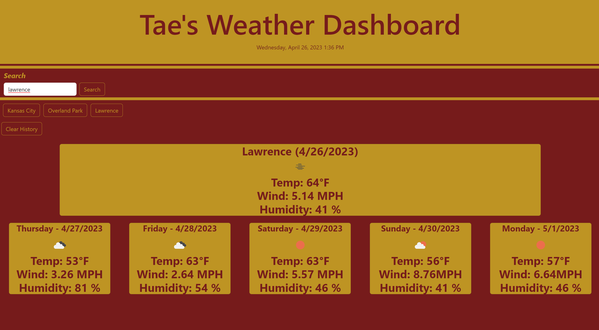

# Weather-Dashboard

## Description

The challenge for this assignment was to create a simple calender application that allows a user to save events for each hour of the day. The app runs in the browser and features dynamically updated HTML and CSS that is powered by JQuery.

In this project, I learned how to practice and implement:
- Third-Party APIs: JQuery and DayJS libraries. 
- Local Storage: to store data in the user's browser.
- JSON: to convert object data to and from local storage.
- JQuery: to simplify DOM manipulation and event handling.
- Events: utilizing .on('Click') to handle click events.
- DayJS: to make Date object easier to parse, validate, and display.

## Installation

N/A

## Usage

Click [Here](https://afrazier01.github.io/Daily-Planner/) to go to my deployed webpage. The date and time are displayed at the top of the page when it loads. You have the potential to see three different background colors based on the time you open the scheduler. Green signals a future time block, red signals the present hour time block, and grey signals the time block has already occurred for the day. Simply insert the text you want for the time of the day and click the save button to submit your event. The event is saved to the local storage so you can come back later to see all your events are still saved and make edits as necessary. 

Once the webpage is open, view the local storage by using Chrome DevTools. Right-click and select inspect; or for windows - Control + Shift + I and for MacOS - Command + Option + I. Navigate to the the application tab and local storage to observe the saved values in your local storage.

Here is a look at the deployed webpage:

## Credits

N/A

## License

Please refer to the LICENSE in the repo.